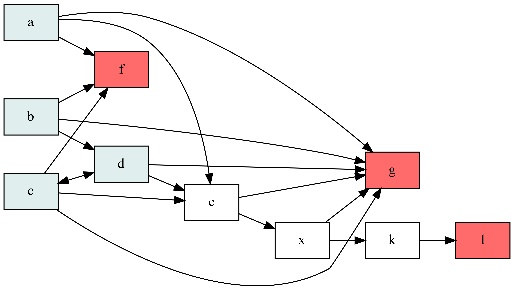

# PicoSM - Pico State Management

## About
Very small and fast Elixir library for state transitions validation with
ability to generate graphical representation of the flow using `graphviz`.

## Usage
Define a module with a set of simple transition rules, using `nil` as an initial state
```elixir
defmodule MyFlow do
  use PicoSM,
    rules: [
      nil: :a,
      nil: :b,
      nil: :c,
      nil: :d,
      a: :e,
      a: :f,
      a: :g,
      b: :d,
      b: :f,
      b: :g,
      c: :d,
      c: :f,
      c: :e,
      c: :g,
      k: :l,
      d: :c,
      d: :e,
      d: :g,
      x: :k,
      x: :g,
      e: :x,
      e: :g
    ]
end
```
```
> MyFlow.permit(nil, :a)
:ok

> MyFlow.permit(:b, :e)
{:error, :transition_impossible}

> PicoSM.save_visualization(MyFlow, "./visualization.png")
:ok
```
Blue states are initial, red states are final.


## Installation

The package can be installed by adding `pico_sm` to your list of dependencies in `mix.exs`:

```elixir
def deps do
  [
    {:pico_sm, "~> 0.1.0"}
  ]
end
```

The docs can be found at [https://hexdocs.pm/pico_sm](https://hexdocs.pm/pico_sm).
